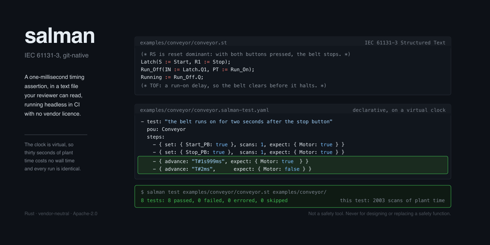

# salman

[](https://github.com/celikgo/salman/actions/workflows/ci.yml)
[](https://github.com/celikgo/salman/actions/workflows/perf.yml)
[](https://github.com/celikgo/salman/actions/workflows/determinism.yml)
[](https://github.com/celikgo/salman/actions/workflows/supply-chain.yml)
[](https://github.com/celikgo/salman/actions/workflows/docs-links.yml)
[](https://github.com/celikgo/salman/actions/workflows/interop.yml)
[](https://github.com/celikgo/salman/actions/workflows/fuzz.yml)
[](https://github.com/celikgo/salman/actions/workflows/version-consistency.yml)



<sub>Both files are `examples/conveyor/`, unedited, and the result line is what `salman test` prints. The clock is virtual: that one assertion costs 2003 scans of plant time and no wall time.</sub>

A vendor-neutral, text-first, git-native workbench for IEC 61131-3 PLC engineering,
industrial communication, and deterministic-network simulation.

**Version 0.1.0. Pre-alpha.** What exists today is the language core and one
protocol: Structured Text compiles and runs on an embedded deterministic
runtime, a declarative test suite runs against it headless on any operating
system with no vendor licence, and salman speaks Modbus TCP and RTU well enough
to read a real device and to say what happened on a packet capture. There is no
user interface, no protocol but Modbus, no network model and no AI layer; those
are the roadmap, not the product. `docs/CONFORMANCE.md` says exactly what is
implemented, what is tested, and what salman had to decide for itself because no
source available to it settled the question.

---

## Quick start

Three commands, from an empty directory to a Structured Text program running
with its tests passing. Rust is the only prerequisite, and `rustup` installs the
pinned toolchain by itself — no licence server, no vendor SDK, no C toolchain.

```bash
git clone https://github.com/celikgo/salman.git
cd salman
cargo run --release -- test examples/conveyor/conveyor.st examples/conveyor/
```

The third command builds salman and runs the declarative test suite for the
worked example — a conveyor with a start/stop interlock, a part counter and a
jam timer:

```
 pass  the belt does not run until the start button is pressed  (2 scans, T#1ms)
 pass  the belt runs on for two seconds after the stop button, then stops  (2003 scans, T#2s2ms)
 pass  the stop button wins when both buttons are pressed, and there is no start-up pulse  (3002 scans, T#3s1ms)
 pass  each part counts exactly once, on the leading edge of the sensor  (9 scans, T#8ms)
 pass  the batch completes at ten parts and progress reaches one hundred percent  (21 scans, T#20ms)
 pass  a jam is flagged after ten seconds of running with no part  (10002 scans, T#10s1ms)
 pass  a part restarts the jam timer  (20002 scans, T#20s1ms)
 pass  the whole sequence produces the recorded trace  (17 scans, T#16ms)

8 tests: 8 passed, 0 failed, 0 errored, 0 skipped
```

Twenty thousand scans of simulated conveyor, twenty seconds of simulated time,
in a few milliseconds of real time — the same answer on every machine, with no
PLC and no licence server. The test file is
[`examples/conveyor/conveyor.salman-test.yaml`](examples/conveyor/conveyor.salman-test.yaml);
the golden trace it compares against is a text file you can read and diff. Both
are meant to be reviewed in a pull request, which is the point of the whole
exercise.

`salman test` exits non-zero on failure and can write JUnit XML, so the same
command is a CI job. There is no GUI to drive and no licence to check out.

The same binary type-checks a program and runs one on its own:

```bash
cargo run --release -- check examples/conveyor/conveyor.st
cargo run --release -- run   examples/conveyor/conveyor.st --until T#5s --record Running,Count
```

`check` prints `no errors`. `run` executes 5001 scans of simulated time and
writes a trace with a SHA-256 fingerprint in its header — run it twice, on two
machines, and the fingerprint is the same.

### Getting a binary without cloning

Prebuilt binaries for Linux, macOS (Intel and Apple silicon) and Windows are
attached to each [release](https://github.com/celikgo/salman/releases). Download
one, mark it executable, and every command in this README works with `salman` in
place of `cargo run --release --`. salman is a single self-contained executable:
no installer, no service, no registry key, and deleting the file uninstalls it.

The workspace is packaged for crates.io — every crate carries its metadata and
`cargo package --workspace` verifies all thirteen — and `release.yml` publishes
them when a version tag is pushed. Until that tag is cut there is nothing on
crates.io to install, so `cargo install salman-cli` will not find salman yet and
the releases page is the way to get a binary without a Rust toolchain.

The worked example lives in this repository rather than in the binary, so the
clone above is still the shortest path to watching salman do something.

---

## What it costs to run

Measured by the `performance budget` workflow on GitHub-hosted runners, not on a
developer's laptop. These are the numbers from the run on commit `624e176`:

| | Linux x86-64 | macOS aarch64 | Windows x86-64 |
|---|---|---|---|
| Cold start of `salman version` | ~0.8 ms | ~0.9 ms | ~7 ms |
| Binary on disk | 3.4 MB | 2.8 MB | 3.1 MB |
| Peak resident set | 2.8 MB | 1.9 MB | not gated |
| `cargo test --workspace`, excluding the build | ~2 s | ~2 s | ~3 s |

The sizes are exact and the times are approximate on purpose: the runners are
shared-tenant virtual machines, and three runs of the same commit have measured
macOS cold start at 0.93 ms, 1.21 ms and 4.26 ms. Publishing any of them to two
decimal places would imply a precision that is not there. The exact numbers from
each run, and the budget that gates them, are in the performance budget section
below.

A conventional vendor IEC 61131-3 environment is a multi-gigabyte installation
that wants a licence server and, usually, Windows. salman is one binary of about
three megabytes that starts in about a millisecond and runs its whole test suite
in about two seconds, on three operating systems, with nothing to activate. The
comparison is left to the reader; the numbers above are the ones salman can
defend, and [`perf-budget.toml`](perf-budget.toml) is the gate that keeps them
true — the `perf` workflow fails the build when a measurement exceeds it.

Two honest caveats. These are single runs on shared-tenant virtual machines, so
they move by more than a little — the same commit has measured macOS cold start
at 0.93 ms on one run and 4.26 ms on another. Treat them as an order of
magnitude, which is all the budget gates. And peak resident set is measured on `salman
version`, the smallest thing the binary does — 30 000 scans of the conveyor
example peaks around 2.9 MB, and nothing in CI gates that figure.

There is no screenshot because there is no graphical interface yet. It arrives
with the workbench milestone; see `docs/ROADMAP.md`.

---

## What this is NOT

- **Not a safety PLC and not a safety tool.** Nothing here is IEC 61508 /
  IEC 62061 / ISO 13849 certified. Never use it to design, validate or replace a
  safety function.
- **Not a certified runtime.** The embedded runtime is for development, testing
  and simulation. It is not for controlling machinery, and the docs must say so
  on every page that mentions it.
- **Not a replacement for vendor engineering tools.** Downloading to a physical
  PLC, commissioning, and vendor-specific configuration remain vendor tooling's
  job. `salman` reads, writes, analyses, simulates and tests.
- **Not a 3GPP-compliant 5G stack.** The network layer models the *effect* of a
  network on a control loop, parameterised from published profiles. It does not
  implement RAN or core.
- **Not a plant physics engine.** Process models are simple and pluggable. For
  real physics, it federates with an external simulator; it does not pretend to
  be one.
- **Not an offensive-security tool.** Read-only by default, always.

## Security and safety boundary

`salman` is an **engineering and diagnostic tool**. It is designed for networks
and equipment the user owns or is authorised to work on.

- Read-only by default; writes require an armed posture and per-call
  confirmation.
- No network discovery outside explicitly user-declared address ranges.
- No credential guessing, no exploitation, no fuzzing of live equipment, no
  denial of service, no firmware manipulation. These capabilities are not
  present and will not be added.
- Captures may contain process data and credentials: redaction is on by default
  in exported bundles, and the redaction rules are documented and testable.
- Follow IEC 62443 concepts in the architecture and say which parts of it the
  tool addresses and which it does not.

The posture model (`crates/salman-core/src/posture.rs`) was written before
anything could reach a network, so that the first write path could not be
written without going through it. That path now exists — a Modbus TCP client —
and it does: `Client::write` requires the ARMED posture and takes a
`UserConfirmation` **by value**, so one confirmation authorises exactly one
write and cannot be kept. That type has no public constructor and can only come
from asking a person, so an automated caller cannot manufacture consent. Reads
need no permission, which is what read-only by default means. Firmware
operations, credential guessing and denial of service are refused at every
posture, in code, and are not configuration options. See
[`SECURITY.md`](SECURITY.md) and
[`docs/adr/ADR-0002-read-only-by-default.md`](docs/adr/ADR-0002-read-only-by-default.md).

**Not a safety tool.** salman is not certified, assessed, qualified or approved
under IEC 61508, IEC 62061, ISO 13849 or any other functional safety standard,
and no such assessment is planned. See [`LEGAL.md`](LEGAL.md).

---

## The standard, and which edition

salman targets **IEC 61131-3:2013 (Edition 3.0)**. That edition was **withdrawn
on 2025-05-22** and superseded by IEC 61131-3:2025 (Edition 4.0), which is the
current edition. salman targets Edition 3.0 because it is the edition its public
sources allow it to verify; targeting one it cannot check would be guessing.

Clause numbers are edition-specific — Structured Text is §7.3 in Edition 3.0 and
§7.2 in Edition 4.0 — so salman never writes a clause number without its year and
edition. No normative IEC text is reproduced anywhere in this repository.
[`docs/IEC_CITATIONS.md`](docs/IEC_CITATIONS.md) lists every citation salman
makes and how far each number could be cross-checked against a public source.

**salman claims no conformance and no compliance.** It aims at Structured Text
and publishes a per-feature account in [`docs/CONFORMANCE.md`](docs/CONFORMANCE.md).

---

## The performance budget

Rule 5: the lightweight budget is a tested gate, not a slogan.
`.github/workflows/perf.yml` measures the four rows below and fails when a
measurement exceeds the threshold in [`perf-budget.toml`](perf-budget.toml).

| Measurement | Budget | Linux x86-64 | macOS aarch64 | Windows x86-64 |
|---|---|---|---|---|
| Cold start of `salman version` | 2 s | **0.86 ms** | **4.26 ms** | **7.98 ms** |
| Release binary on disk | 120 MB* | **3.39 MB** | **2.80 MB** | **3.10 MB** |
| Peak resident set | 350 MB | **2.65 MB** | **1.93 MB** | not gated† |
| `cargo test --workspace`, excluding the build | 60 s | **1 s** | **2 s** | **2.78 s** |

Those are the numbers the `performance budget` job measured on GitHub-hosted
runners, not numbers from a developer's laptop, on commit `d85c241`. They cover
a tree with thirteen crates and 1200 tests in it; the suite still runs in
seconds and the binary is still under four megabytes.

Read them as an order of magnitude rather than as constants. The run before it,
on `3c41d1a`, gave 0.84 ms, 1.21 ms and 7.34 ms for cold start: the macOS figure
moved by a factor of three and a half between two runs of code that had not
changed in any way that could affect it. That is what a shared-tenant runner is
like, and it is why the budget column is a ceiling set to catch a change making
salman ten times worse rather than fifteen percent worse. Every commit's real
numbers are in that commit's `perf` run.

\* The 120 MB figure is an **installer** budget. There is no installer yet, so
that job currently weighs the CLI binary against the same number; `perf-budget.toml`
says so rather than letting a passing run be read as evidence the installer fits.

† Peak resident set is not gated on Windows. Reading it reliably after a process
exits is awkward there, and a measurement salman is not confident in is worse
than an admitted gap. Linux and macOS are gated.

Two things this table is not. The peak resident set is measured on
`salman version`, which is the smallest thing the binary does; a longer run costs
more — 30 000 scans of the conveyor example peaks at about 2.9 MB — and nothing
in CI gates that figure. And **salman publishes no interpreter throughput
number**: scans per second, instructions per second, or the scan time of a
program of any given size. There is no benchmark in this repository that
measures it, so there is nothing to publish and nothing a reader could check.
See [`docs/adr/ADR-0006-bytecode-vm.md`](docs/adr/ADR-0006-bytecode-vm.md).

---

## What actually works

Generated from the capability registry in `crates/salman-core/src/capability.rs`,
which refuses to call anything tested unless it names tests that exist. The full
table is [`docs/STATUS.md`](docs/STATUS.md); `salman status` prints it.

**Working end to end:** Structured Text — lexer, parser, type checker, bytecode
compiler and a deterministic scan runtime. All ten IEC standard function blocks.
Cyclic, event and freewheeling tasks with a correct process image, and `AT %`
variables bound to it with no copy. Several source files build as one program.
Modbus TCP and RTU framing, a client, and a simulator to point it at — with
every write gated by the posture model. Reading a packet capture and saying
what happened on it, with findings that carry their evidence and say how sure
salman is. The Modbus stack is checked against pymodbus in CI, in both roles. A project file that binds a device's
registers to `%I` and `%Q`, so a program reads a real device through the
process image. salman **reads** live equipment and will not drive its outputs;
see [`docs/adr/ADR-0014-salman-does-not-drive-a-plant.md`](docs/adr/ADR-0014-salman-does-not-drive-a-plant.md).
Declarative unit tests and golden-trace tests, with JUnit XML output and a real
exit code. Two dialect profiles.

**Not written:** every graphical language, Instruction List, the Edition 3
object-oriented extensions, references, most of the standard function library,
every protocol except Modbus, every importer other than PLCopen XML, the
network model, the desktop application and the AI layer. Meeting one of these in source produces a message naming what is
missing, not a confusing failure.

---

## Prior art, and what is actually new here

There is a great deal of existing work, and salman is careful not to overclaim.
[IronPLC](https://github.com/ironplc/ironplc) is an actively developed Rust
IEC 61131-3 toolchain with a bytecode VM, ladder support and an MCP server.
[PLC-lang/rusty](https://github.com/PLC-lang/rusty) is a Rust Structured Text
compiler via LLVM. [matiec](https://github.com/beremiz/matiec) and
[Beremiz](https://github.com/beremiz/beremiz) have been doing this for years.
salman claims novelty for **none** of: a Rust ST parser, a Rust ST compiler, an
open-source IEC 61131-3 runtime, PLC static analysis, PLC unit testing, PLC unit
testing in CI, AI or MCP integration with a PLC compiler, or network
co-simulation of control loops. Each of those has a maintained open-source
implementation today. `docs/ROADMAP.md` lists them.

What salman does claim, in the only shapes the evidence supports:

1. **A bounded negative result.** We could not find an open-source tool that
   performs semantic, graph-level diff of graphical IEC 61131-3 logic usable as a
   git diff or merge driver. Commercial tools exist. This is a bounded search
   result, not proof; if you know of prior art, open an issue and we will amend
   this paragraph. *(salman does not implement this yet either — it is the
   workbench milestone.)*
2. **The gap, not the idea.** Every open-source PLC unit-testing framework we
   found requires a proprietary runtime: TwinCAT, CODESYS, or TIA Portal with
   PLCSIM Advanced. PLC unit testing in CI is not new. What is absent is doing it
   without a vendor licence, and that part works today. `docs/ROADMAP.md` names
   the three frameworks the search found.
3. **Integration stated as integration.** No single tool we found combines
   compiler, deterministic runtime, semantic diff, CI unit tests and network
   co-simulation. Integration is the contribution; salman did not invent the
   parts.

---

## Engineering rules

Hard gates. A pull request violating any of them does not merge.

1. **CI exists before feature #1.** The first commit that adds source also adds
   `.github/workflows/ci.yml`.
2. **Never document a surface that does not exist.** A stub says it is a stub, in
   its own output and in the docs.
3. **One source of version truth** — the `crates/salman-core/VERSION` file, checked when
   `salman-core` compiles, so it cannot drift on any machine.
4. **Every URL in every doc resolves**, checked in CI.
5. **The lightweight budget is a tested gate**, not a slogan.
6. **Determinism.** Same project, same inputs, same seed, identical trace, bit
   for bit. See [`docs/adr/ADR-0005-determinism.md`](docs/adr/ADR-0005-determinism.md)
   for the mechanisms and for the honest scope of the claim — cross-platform
   determinism is currently an untested premise that the determinism workflow
   exists to settle.
7. **Untrusted input is treated as hostile.** Every parser is fuzzed in CI and
   must never panic, allocate without bound, or read out of bounds.
8. **Read-only by default.**
9. **Compatibility claims are generated, never written.**

---

## Building

```
cargo build --workspace
cargo test --workspace
```

Requires the toolchain pinned in `rust-toolchain.toml`, which `rustup` installs
automatically. Nothing else: no C compiler, no vendor SDK, no licence server.

The shipped binary is **36 crates** — salman's own ten, and twenty-six from
crates.io, of which four are direct dependencies and the rest arrive through
them. It contains no `unsafe`: the workspace forbids it. `cargo deny` runs in CI
over advisories, licences, bans and sources, and [`LEGAL.md`](LEGAL.md) §8 lists
every dependency, its licence and how it enters.

## Documentation

| | |
|---|---|
| [`docs/PIPELINE_WALKTHROUGH.md`](docs/PIPELINE_WALKTHROUGH.md) | The worked example from source to passing test, with the real output at every stage. Start here if Structured Text is new to you |
| [`docs/CONFORMANCE.md`](docs/CONFORMANCE.md) | What of IEC 61131-3 is implemented, tested, absent, or a salman decision |
| [`docs/STATUS.md`](docs/STATUS.md) | Generated capability table |
| [`docs/ROADMAP.md`](docs/ROADMAP.md) | Milestones, open questions and prior art |
| [`docs/IEC_CITATIONS.md`](docs/IEC_CITATIONS.md) | Every clause salman cites, and how far each number was verified |
| [`docs/AI_POLICY.md`](docs/AI_POLICY.md) | How salman is developed, and the policy for the AI layer it will ship |
| [`docs/adr/`](docs/adr/) | Architecture decisions, numbered without gaps |
| [`LEGAL.md`](LEGAL.md) | Standards copyright, trademarks, safety, licence, export control |
| [`SECURITY.md`](SECURITY.md) | Reporting, supported versions, what salman deliberately cannot do |
| [`CONTRIBUTING.md`](CONTRIBUTING.md) | How to build, the test tiers, the ADR process, the bar for a new protocol |
| [`CLAUDE.md`](CLAUDE.md) | One-page orientation: crate layout, the lints, the generated files, the traps |
| [`.claude/skills/`](.claude/skills/) | Working knowledge, one file per job: the language pipeline, determinism, the protocol seam, the citation policy, releasing |
| [`CODE_OF_CONDUCT.md`](CODE_OF_CONDUCT.md) | Contributor Covenant 2.1, and how to report |

## Contributing

[`CONTRIBUTING.md`](CONTRIBUTING.md) covers building, the seven test tiers, the
ADR process and what a new protocol has to clear. The short version: every claim
needs a test, and the review will ask which one.

## Licence

Apache-2.0. See [`LICENSE`](LICENSE).

salman is an independent open-source project. It is not affiliated with, endorsed
by, or sponsored by any third party. References to third-party names are
descriptive only; see [`LEGAL.md`](LEGAL.md).
